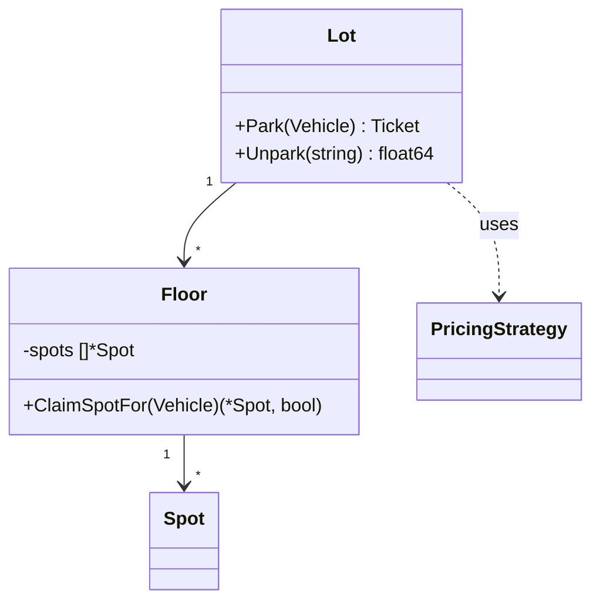

# Publishing a worked LLD solution

For an assistant that has just solved a low-level design question and wants to put the whole
thing on the board: the reasoning as sections, the implementation as real files.

Use **`publish_lld_solution`**. Use `publish_lld_design` instead when all you have is prose notes
and no code — they file to the same place and differ only in what you are holding.

---

## What a worked page is made of

Two parts, stored differently and rendered differently.

**The reasoning** becomes the page body. You send named sections; the server composes the
Markdown. You do not choose the headings or their order, and you should not send a pre-formatted
body — the point is that every worked page comes out identical in shape, so it can be skimmed.

**The code** becomes the page's Code panel: a collapsible section below Watch & read that renders
a folder tree and a syntax-highlighted pane, with an Expand button for a full-screen view. It is
a viewer, not an editor. Code does **not** go in the body — a twelve-file module pasted into
Markdown is a wall that gets scrolled past.

### The seven sections, in order

| # | Section | Argument | What belongs in it |
|--:|---|---|---|
| 1 | Problem statement | `problem_statement` | What is being asked, as an interviewer would put it |
| 2 | Requirements | `requirements` | Functional and non-functional, ideally a list |
| 3 | Entities | `entities` | The things, and what each one owns |
| 4 | Relationships and diagrams | `relationships` | How they relate — **use a Mermaid diagram** |
| 5 | Interfaces | `interfaces` | The seams, and what each exists to let vary |
| 6 | Design choices and principles | `design_choices` | **A structured list**, rendered as a table |
| 7 | Cases handled and edge cases | `edge_cases` | What breaks at the edges, handled and not |

The order is fixed and is the order the design is actually derived in — you cannot name entities
before you have requirements, or justify a pattern before the interfaces exist. A page read top
to bottom reproduces the reasoning rather than listing its conclusions.

Sections you leave empty are skipped, not rendered as an empty heading.

---

## Diagrams

A ```` ```mermaid ```` fence is rendered as a real diagram on the page. For section 4 a
`classDiagram` is almost always the right answer:

````

````

Anything Mermaid supports works — `sequenceDiagram` for a flow, `stateDiagram-v2` for a lifecycle.
Check the syntax: a fence that will not parse falls back to showing its source with a warning,
which is legible but is not a diagram.

---

## The design-choices table

Send `design_choices` as a list of rows, **not** as hand-written Markdown:

```json
[
  {
    "component": "Bay allocation",
    "choice": "Smallest free bay that fits",
    "principle": "Strategy-free; a single rule in one place",
    "why": "First-fit lets a motorcycle take the last truck bay while compact bays sit empty"
  },
  {
    "component": "Pricing",
    "choice": "PricingStrategy interface with two implementations",
    "principle": "OCP, Strategy",
    "why": "Rates change constantly and have nothing to do with allocation"
  }
]
```

The server builds the table and escapes the cells. A pipe inside a hand-written cell silently
shifts every later column — the table still renders, just wrongly, so nobody notices. `principle`
and `why` are optional, and a column no row fills is dropped rather than left empty down the
whole table.

One row per part of the design that involved a real decision. A row that says "Used a class"
is noise.

---

## The code

**Write it in Go.** Every worked implementation in this tree is Go; a page in another language is
the odd one out in a set meant to be revised together.

Send `code_files` as a list of `{"path": ..., "content": ...}`:

```json
[
  {"path": "go.mod",                  "content": "module parkinglot\n\ngo 1.24\n"},
  {"path": "model/spot.go",           "content": "package model\n..."},
  {"path": "lot/lot.go",              "content": "package lot\n..."},
  {"path": "lot/lot_test.go",         "content": "package lot_test\n..."},
  {"path": "cmd/parkinglot/main.go",  "content": "package main\n..."},
  {"path": "README.md",               "content": "# Design a Parking Lot\n..."}
]
```

Rules that matter:

- **`path` carries the structure.** The folder tree is derived from these strings, so
  `cmd/parkinglot/main.go` nests three deep. There is no separate folder list, and an empty
  folder cannot exist.
- **Publishing any file replaces the whole workspace.** A solution is rewritten as a unit —
  files renamed, packages split — and merging would leave the previous version's orphans beside
  the new ones. Always send the complete set. Sending *no* files leaves what is there untouched,
  so a prose correction does not wipe the implementation.
- **Omit `language`.** It is derived from the extension, and a guessed highlight.js grammar id is
  more likely to be wrong than the extension.
- **Include `go.mod`, the tests and a `README.md`.** The tests are the part that proves the
  design, and the README is what makes the page readable without running anything.
- **Compile and test before publishing.** Go is installed on this machine. Run `gofmt -l .`,
  `go vet ./...` and `go test -race ./...`, and do not publish code you have not run. Storing code
  that does not compile is worse than storing none: it is revised from under the assumption it
  works.

Write real Go, not a transliterated Java answer — a struct with a size field rather than a class
hierarchy, interfaces only for the seams that genuinely vary, unexported methods where Java would
use package-private.

---

## Before you publish

**Call `prep_search` first.** If the question already has a page, publish to it with
`on_conflict: "replace"` rather than creating a near-duplicate under a slightly different title.

`on_conflict` behaviour for this tool specifically:

| Value | Effect |
|---|---|
| `error` (default) | Refuses if the page exists |
| `merge` | Fills empty metadata, but still replaces the composed body and the code |
| `replace` | Overwrites the page |

`merge` still replaces the body here because a structured solution is not a hand-written note —
it is the answer, republished because it changed.

**Set `frequency`.** It defaults to 0, which sorts the page to the bottom of every list.

---

## A complete call

```python
publish_lld_solution(
    title="Design a Parking Lot",
    prompt="Floors and bays sized by vehicle; ticket on entry, fee on exit.",
    problem_statement="...",
    requirements="- Multiple floors...\n- A vehicle fits its own size of bay or larger...",
    entities="**Vehicle** — identity is the plate...\n**Spot** — one bay...",
    relationships="```mermaid\nclassDiagram\n    Lot --> Floor\n```",
    interfaces="**PricingStrategy** — what a stay costs...\n**Clock** — the only way...",
    design_choices=[
        {"component": "Bay allocation", "choice": "Smallest fit",
         "principle": "Single rule, one place", "why": "First-fit strands trucks"},
    ],
    edge_cases="- Two drivers, one bay: find-and-occupy under one lock...\n- Double exit...",
    code_files=[{"path": "go.mod", "content": "module parkinglot\n\ngo 1.24\n"}],
    difficulty="easy",
    frequency=5,
    topics=["strategy-pattern", "concurrency"],
    companies=["Eightfold"],
    resources=[{"url": "https://www.youtube.com/watch?v=...", "title": "Parking Lot LLD"}],
    on_conflict="replace",
)
```

---

## Publishing without MCP

The tool is a thin wrapper over `POST /api/prep/pages`. Any client holding the bearer token and
the Access service token can send the same payload — `solution` and `code_files` are ordinary
fields on that endpoint. See [api.md](api.md). The composition, the table building and the
file replacement all happen on the server, so a direct caller gets the same page shape as the
MCP tool does.
