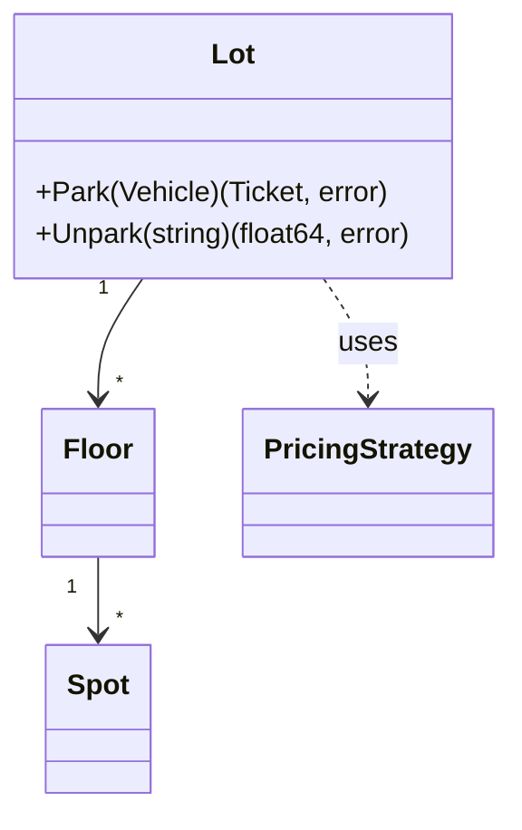

# Publishing a worked LLD solution

For an assistant that has just worked through a low-level design question with Sarthak and wants
to put the whole thing on the board: the reasoning as sections, the implementation as real files.

Use **`publish_lld_solution`**. Use `publish_lld_design` instead when all you have is prose notes
and no code — they file to the same place and differ only in what you are holding.

---

## The rule that matters most: one hour

The page must describe an answer a candidate can **design, explain and code in a 60-minute
interview**. Not a production system, and not everything the problem could possibly contain.

Over-scoping is the commonest failure, and it is worse than under-scoping: a design you cannot
finish in the room reads as a candidate who cannot prioritise.

Before publishing, **check the question against how it is actually solved elsewhere** — LeetCode
discuss threads, [awesome-low-level-design](https://github.com/ashishps1/awesome-low-level-design),
Hello Interview's problem breakdowns — and cut anything those do not carry. Concretely:

- **Six to ten types is normal.** Twenty means the model has grown past the interview.
- **Two or three interfaces**, each with a real reason to vary. More usually means seams invented
  to look thorough.
- **Persistence, auth, retries, metrics and deployment are almost always out of scope.** Saying
  so explicitly, in Requirements, is a better answer than building them.
- The code should be a module you could type in ~25 minutes, leaving time to talk.

If a question genuinely needs more, say so in Talking points rather than silently growing the
design.

---

## What a worked page is made of

Two parts, stored differently and rendered differently.

**The reasoning** becomes the page body. You send named sections; the server composes the
Markdown. You do not choose the headings or their order, and you should not send a pre-formatted
body — the point is that every worked page comes out identical in shape, so it can be skimmed.

**The code** becomes the page's Code panel: a collapsible section below Watch & read that renders
a folder tree and a syntax-highlighted pane, with an Expand button for a full-screen view. Code
does **not** go in the body — a twelve-file module pasted into Markdown gets scrolled past.

### The seven sections, in order

| # | Section | Argument | What belongs in it |
|--:|---|---|---|
| 1 | Problem statement | `problem_statement` | What is being asked, as an interviewer would put it |
| 2 | Requirements | `requirements` | Functional, non-functional, **and what is out of scope** |
| 3 | Entities and interfaces | `entities`, `interfaces` | **Two tables** — the types with their fields, and the seams with their signatures |
| 4 | Relationships and diagrams | `relationships` | How they relate — **use a Mermaid diagram** |
| 5 | Design choices and principles | `design_choices` | **A table** — one row per real decision, with the principle or pattern |
| 6 | Cases handled and edge cases | `edge_cases` | What breaks at the edges, handled and deliberately not |
| 7 | Talking points | `talking_points` | What you would actually say in the room |

The order is fixed and is the order the design is derived in — you cannot name entities before you
have requirements, or justify a pattern before the interfaces exist. Talking points come last
because they are what you revise on the morning of the interview.

Sections you leave empty are skipped, not rendered as an empty heading.

---

## Entities and interfaces are tables

Send rows. Do **not** hand-write Markdown tables: a stray `|` in a cell shifts every column after
it, the table still renders, and nobody notices. The server builds and escapes them.

```json
"entities": [
  {"name": "Spot",
   "fields": "id string, size Size, occupant *Vehicle",
   "responsibility": "One bay, and whether it is taken"},
  {"name": "Floor",
   "fields": "number int, mu sync.Mutex, spots []*Spot",
   "responsibility": "Allocation among the bays on one floor"}
],
"interfaces": [
  {"name": "PricingStrategy",
   "signature": "Price(size Size, stay time.Duration) (float64, error)",
   "purpose": "Rate schemes, which change far more often than allocation"},
  {"name": "Clock",
   "signature": "Now() time.Time",
   "purpose": "Lets a test price a three-hour stay without waiting three hours"}
]
```

`fields` carries the **actual fields with types** — this is the table a reader checks when they
cannot remember the model, so "some fields" is useless. `signature` is the method set and renders
as code. An interface with no answer for `purpose` probably should not exist.

Both render under one **Entities and interfaces** heading, as `### Entities` and `### Interfaces`
sub-sections — they are one question in the room, and splitting them put the diagram between them.

---

## The design-choices table

One row per decision that was genuinely a decision. "Used a class" is noise.

```json
[
  {"component": "Bay allocation",
   "choice": "Smallest free bay that fits",
   "principle": "One rule, in one place",
   "why": "First-fit lets a motorcycle take the last truck bay while compact bays sit empty"},
  {"component": "Pricing",
   "choice": "PricingStrategy interface, two implementations",
   "principle": "OCP, Strategy",
   "why": "Rates change constantly and have nothing to do with allocation"}
]
```

`principle` is the SOLID principle or pattern; `why` is the reason. A column no row fills is
dropped rather than left empty down the whole table.

---

## Diagrams

A ```` ```mermaid ```` fence renders as a real diagram. For section 4 a `classDiagram` is usually
right; `stateDiagram-v2` when the question is a lifecycle.

````

````

Check the syntax: a fence that will not parse falls back to showing its source with a warning.

---

## Talking points

The section that does not exist in most write-ups and matters most on the day. Write a short list:

- the two or three sentences you would **open** with;
- the trade-off you would **volunteer** before being asked;
- the extension you would name for "how would you add X";
- what you deliberately left out, and why.

---

## The code

**Write it in Go**, and make it a module that runs:

```json
[
  {"path": "go.mod",                 "content": "module parkinglot\n\ngo 1.24\n"},
  {"path": "model/spot.go",          "content": "package model\n..."},
  {"path": "lot/lot.go",             "content": "package lot\n..."},
  {"path": "lot/lot_test.go",        "content": "package lot_test\n..."},
  {"path": "cmd/demo/main.go",       "content": "package main\n..."},
  {"path": "README.md",              "content": "# Design a Parking Lot\n..."}
]
```

Rules that matter:

- **`path` carries the structure.** The folder tree is derived from these strings. There is no
  separate folder list, and an empty folder cannot exist.
- **Include `cmd/demo/main.go`.** Go allows one package per directory, so `package main` cannot
  sit beside the library in the module root — the demo goes in its own directory and runs with
  `go run ./cmd/demo`.
- **Publishing any file replaces the whole workspace.** A solution is rewritten as a unit, and
  merging would leave the previous version's orphans beside the new ones. Always send the
  complete set. Sending *no* files leaves what is there untouched.
- **Omit `language`.** It is derived from the extension.
- **Compile and run before publishing.** Go is installed on this machine:

      gofmt -l .
      go vet ./...
      go test -race ./...
      go run ./cmd/demo

  Do not publish code you have not run. Storing code that does not compile is worse than storing
  none: it is revised from under the assumption that it works.

Write real Go, not a transliterated Java answer — a struct with a size field rather than a class
hierarchy, interfaces only for the seams that genuinely vary.

---

## Before you publish

**Call `prep_search` first.** If the question already has a page, publish to it with
`on_conflict: "replace"` rather than creating a near-duplicate under a slightly different title.

| `on_conflict` | Effect |
|---|---|
| `error` (default) | Refuses if the page exists |
| `merge` | Fills empty metadata, but still replaces the composed body and the code |
| `replace` | Overwrites the page |

`merge` still replaces the body here because a structured solution is not a hand-written note —
it is the answer, republished because it changed.

**Set `frequency`.** It defaults to 0, which sorts the page to the bottom of every list.

---

## Publishing without MCP

The tool is a thin wrapper over `POST /api/prep/pages`. Any client holding the bearer token and
the Access service token can send the same payload — `solution` and `code_files` are ordinary
fields on that endpoint. See [api.md](api.md). Composition, table building and file replacement
all happen on the server, so a direct caller gets the same page shape.
